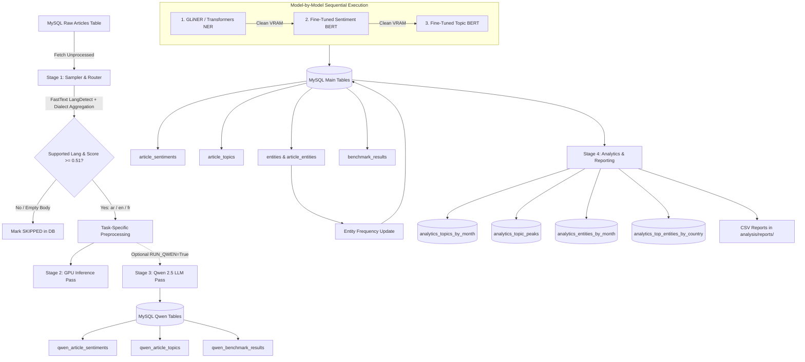

# Multilingual NLP Pipeline for News Analysis

An automated, high-throughput NLP enrichment pipeline for Arabic, English, and French news articles using fine-tuned BERT-based models, GLiNER token classification, and GPU-accelerated batch inference with comparative LLM evaluation (Qwen 2.5).

---

## Table of Contents

- [Project Overview](#project-overview)
- [Architecture & Pipeline Flow](#architecture--pipeline-flow)
- [Model Registry & Taxonomy](#model-registry--taxonomy)
  - [Named Entity Recognition (NER)](#named-entity-recognition-ner)
  - [Sentiment Analysis](#sentiment-analysis)
  - [Topic Classification (18 Categories)](#topic-classification-18-categories)
  - [Global Model ID Mapping](#global-model-id-mapping)
- [Database Architecture](#database-architecture)
  - [Schema Overview](#schema-overview)
  - [Database Table Definitions](#database-table-definitions)
  - [Entity Deduplication & Linking](#entity-deduplication--linking)
  - [Benchmark & Metrics Tracking](#benchmark--metrics-tracking)
- [Codebase Structure](#codebase-structure)
- [Configuration Guide](#configuration-guide)
  - [Modular Configuration Package](#modular-configuration-package)
  - [Environment Variables (.env.local)](#environment-variables-envlocal)
- [Preprocessing Pipelines](#preprocessing-pipelines)
  - [Arabic Preprocessing Engine](#arabic-preprocessing-engine)
  - [Latin (English/French) Preprocessing Engine](#latin-englishfrench-preprocessing-engine)
- [Quick Start](#quick-start)
  - [1. Environment Setup](#1-environment-setup)
  - [2. Configuration](#2-configuration)
  - [3. Running the Pipeline](#3-running-the-pipeline)
  - [4. Standalone Benchmarking](#4-standalone-benchmarking)
  - [5. Analytics & Report Generation](#5-analytics--report-generation)
- [Hardware & Performance Optimization](#hardware--performance-optimization)

---

## Project Overview

This production-grade pipeline processes raw multilingual news articles from a MySQL repository, automatically detects language, performs text normalization, and executes three core NLP extraction tasks:

| Task | Primary Engine | Output |
| :--- | :--- | :--- |
| **Language Identification** | `fast-langdetect` (FastText `lid.176.bin`) | ISO language (`ar`, `en`, `fr`) + dialect confidence score |
| **Named Entity Recognition** | `GLiNER` (`gliner_multi-v2.1`) & Transformers | Extracted entities with unified taxonomy (`PER`, `ORG`, `LOC`, `DAT`, `EVE`, `PRO`, `COM`, `MIS`) |
| **Sentiment Analysis** | Fine-tuned BERT (Per-language custom heads) | `POSITIVE`, `NEGATIVE`, `NEUTRAL` + probability distributions |
| **Topic Classification** | Fine-tuned BERT / Zero-Shot sequence classifiers | 18 standardized macro-categories + confidence scores |
| **Comparative LLM Pass** | Qwen 2.5:7b (via Ollama API) | Independent parallel predictions for cross-model validation |
| **Analytics & Reporting** | Automated SQL aggregations & Pandas analytics | Time-series topic trends, Z-score spike detection, entity distributions |

All inference results, entity frequencies, and execution benchmarks (latency per document, peak GPU memory allocated) are persisted back into MySQL in an idempotent, transaction-safe manner.

---

## Architecture & Pipeline Flow



### Execution Lifecycle:

1. **Sampling & Filtering (`pipeline/sampler.py`)**:
   - Queries `article` for batches where `article_sentiments.sentiment_label IS NULL`.
   - Cleans text specifically for language detection via `PreprocessRouter`.
   - Evaluates FastText top-5 dialect predictions with Arabic script fallback (`ARABIC_LANG_CODES` aggregation and Unicode ratio check).
   - Articles not meeting confidence thresholds or resulting in empty text after cleaning are immediately marked as `SKIPPED` (`language = NULL`) across `article_sentiments`, `article_topics`, `qwen_article_sentiments`, and `qwen_article_topics` to prevent re-fetching.
   - Pre-inserts placeholder rows with detected `language` into all four sentiment and topic tables to lock in-progress processing.

2. **GPU Inference Pass (`pipeline/gpu_pass.py`)**:
   - Executes models sequentially with explicit CUDA cache cleanup and cooldown timers to prevent Out-Of-Memory (OOM) exceptions.
   - Records per-article execution time (`total_inf_time_sec`), batch average latency (`avg_ms_per_doc`), and peak VRAM allocation (`peak_gpu_mb`).
   - Normalizes and links entities dynamically into global dictionaries with fuzzy matching.

3. **Qwen LLM Parallel Pass (`src/qwen/run_qwen_pass.py`)**:
   - If enabled (`RUN_QWEN=True`), streams the same normalized texts to a local Ollama instance running `qwen2.5:7b` to capture comparative sentiment and topic evaluations.

4. **Analytics & Trend Detection (`analysis/report_generator.py`)**:
   - Runs automatically after GPU inference. Computes monthly topic distributions, executes rolling Z-score anomaly detection to identify abnormal topic surges, and ranks top entities globally and by country. Results are written to both dedicated MySQL analytics tables and CSV files in `analysis/reports/`.
   - Entity frequency aggregation (`db.update_entity_frequencies()`) runs first to recompute global mention counts in the `entities` table before analytics are generated.

---

## Model Registry & Taxonomy

### Named Entity Recognition (NER)

The pipeline integrates multilingual bi-encoder zero-shot extraction using **GLiNER** (`urchade/gliner_multi-v2.1`) along with traditional Transformers token classification pipelines.

Entity labels are normalized to a standard 8-class schema:

| Canonical Label | Description | Source Mappings |
| :--- | :--- | :--- |
| `PER` | Person / Individual | `PERSON`, `HUMAN`, `PERS`, `PERSON NAME` |
| `ORG` | Organization / Institution / Government | `ORGANIZATION`, `COMPANY`, `INSTITUTION`, `GOV`, `MINISTRY` |
| `LOC` | Location / Country / City / Facility | `LOCATION`, `GPE`, `CITY`, `COUNTRY`, `REGION`, `FACILITY` |
| `DAT` | Date / Time Expression | `DATE`, `TIME`, `DATETIME`, `DATE OR TIME EXPRESSION` |
| `EVE` | Named Event / Conflict / Crisis | `EVENT`, `ARMED CONFLICT`, `POLITICAL CRISIS` |
| `PRO` | Product / Brand Name | `PRODUCT`, `BRAND`, `SOFTWARE`, `APP`, `PLATFORM` |
| `COM` | Competition / League / Tournament | `COMPETITION`, `LEAGUE`, `TOURNAMENT`, `CHAMPIONSHIP` |
| `MIS` | Miscellaneous / Other | `MISC`, `OTHER` |

### Sentiment Analysis

Per-language fine-tuned BERT classifiers located in `finetuned_models/`:
- **Arabic**: `ARABIC SENTIMENT`
- **English**: `ENGLISH SENTIMENT`
- **French**: `FRENSH SENTIMENT`

**Sentinel Labels & Handling:**
- `POSITIVE`: Favorable / optimistic tone.
- `NEGATIVE`: Critical / alarming tone.
- `NEUTRAL`: Informational / objective tone.
- `SKIPPED`: Filtered before inference (low language confidence or empty text).
- Heuristic overrides handle short ambiguous queries and explicit domain crisis keywords (`src/config/heuristics.py`).

### Topic Classification (18 Categories)

Topic classification leverages fine-tuned sequence classification models (`finetuned_models/* TOPIC`) across 18 standardized multilingual categories:

| Index | English | Français | العربية |
| :---: | :--- | :--- | :--- |
| `0` | **Politics** | Politique | السياسة |
| `1` | **Economy** | Économie | الاقتصاد |
| `2` | **Security** | Sécurité | الأمن |
| `3` | **Energy** | Énergie | الطاقة |
| `4` | **Conflict** | Conflit | النزاع |
| `5` | **Elections** | Élections | الانتخابات |
| `6` | **Justice** | Justice | العدالة |
| `7` | **Health** | Santé | الصحة |
| `8` | **Weather** | Météo | الطقس |
| `9` | **Sports** | Sport | الرياضة |
| `10` | **Culture** | Culture | الثقافة |
| `11` | **Education** | Éducation | التعليم |
| `12` | **Technology** | Technologie | التكنولوجيا |
| `13` | **Environment** | Environnement | البيئة |
| `14` | **Diplomacy** | Diplomatie | الدبلوماسية |
| `15` | **Religion** | Religion | الدين |
| `16` | **Migration** | Migration | الهجرة |
| `17` | **General** | Général | عام |

### Global Model ID Mapping

Defined in `src/config/models.py` as the single source of truth across all benchmark and tracking tables:

| Model ID | Key / Identifier | Task & Target Language |
| :---: | :--- | :--- |
| `0` | `hatmimoha/arabic-ner` | Arabic NER (AraBERT) |
| `1` | `CAMeL-Lab/bert-base-arabic-camelbert-msa-ner` | Arabic NER (CAMeL) |
| `2` | `dslim/bert-base-NER` | English NER (BERT) |
| `3` | `Jean-Baptiste/camembert-ner` | French NER (CamemBERT) |
| `4` | `urchade/gliner_multi-v2.1` | Multilingual NER (GLiNER) |
| `5` | `ar_sentiment_ft` | Arabic Sentiment (Fine-tuned BERT) |
| `6` | `en_sentiment_ft` | English Sentiment (Fine-tuned BERT) |
| `7` | `fr_sentiment_ft` | French Sentiment (Fine-tuned BERT) |
| `8` | `ar_topic_ft` | Arabic Topic (Fine-tuned BERT) |
| `9` | `en_topic_ft` | English Topic (Fine-tuned BERT) |
| `10` | `fr_topic_ft` | French Topic (Fine-tuned BERT) |
| `11` | `qwen2.5:7b` | Qwen LLM (Ollama HTTP Inference) |

---

## Database Architecture

### Schema Overview

The pipeline operates on the source raw table (`article`) and initializes and manages **12 relational enrichment and evaluation tables** — 8 inference/benchmark tables and 4 analytics aggregation tables:

```
+----------------------------------------------------+
|                      article                       |
|----------------------------------------------------|
| id (PK, BIGINT)                                    |
| body (TEXT)                                        |
| id_language (INT)                                  |
| id_categories (INT)                                |
| crawl_date (DATETIME)                              |
| year (INT), month (INT), id_countries (VARCHAR)    |
+-------------------------+--------------------------+
                          |
     +--------------------+--------------------+--------------------+
     |                    |                    |                    |
     v                    v                    v                    v
+--------------------+ +--------------------+ +--------------------+ +--------------------+
| article_sentiments | |   article_topics   | |  article_entities  | | benchmark_results  |
|--------------------| |--------------------| |--------------------| |--------------------|
| article_id (PK)    | | article_id (PK)    | | article_id (PK)    | | article_id (PK)    |
| language           | | language           | | entity_id (PK, FK) | | task (PK)          |
| sentiment_label    | | topic_label        | | model_version (PK) | | model_id (PK)      |
| sentiment_score    | | topic_score        | | confidence_score   | | language (PK)      |
+--------------------+ +--------------------+ +---------+----------+ | device (PK)        |
                                                        |            | total_inf_time_sec |
                                                        v            | avg_ms_per_doc     |
                                              +--------------------+ | peak_gpu_mb        |
                                              |      entities      | | created_at         |
                                              |--------------------| +--------------------+
                                              | entity_id (PK, AUTO|
                                              | entity_name        |
                                              | entity_type        |
                                              | normalized_name(UQ)|
                                              | frequency          |
                                              +--------------------+

======================= Comparative LLM Pass (Qwen 2.5) =======================
+--------------------------+  +--------------------------+  +--------------------------+
| qwen_article_sentiments  |  |   qwen_article_topics    |  |  qwen_benchmark_results  |
|--------------------------|  |--------------------------|  |--------------------------|
| article_id (PK)          |  | article_id (PK)          |  | article_id (PK)          |
| language                 |  | language                 |  | task (PK)                |
| sentiment_label          |  | topic_label              |  | model_id (PK)            |
+--------------------------+  +--------------------------+  | language (PK)            |
                                                            | device (PK)              |
                                                            | total_inf_time_sec       |
                                                            | avg_ms_per_doc           |
                                                            | peak_gpu_mb              |
                                                            | created_at               |
                                                            +--------------------------+
```

### Database Table Definitions

#### 1. Main Pipeline Tables

| Table | Primary Key | Key Columns & Types | Description & Indexes |
| :--- | :--- | :--- | :--- |
| **`article_sentiments`** | `article_id` | `language` VARCHAR(10)<br>`sentiment_label` VARCHAR(10)<br>`sentiment_score` FLOAT | Sentiment predictions from fine-tuned BERT models (`POSITIVE`, `NEGATIVE`, `NEUTRAL`, `SKIPPED`). Indexed on `language`. |
| **`article_topics`** | `article_id` | `language` VARCHAR(10)<br>`topic_label` VARCHAR(100)<br>`topic_score` FLOAT | 18-class macro topic classification from fine-tuned models. Indexed on `topic_label` and `language`. |
| **`entities`** | `entity_id` (AUTO_INCREMENT) | `entity_name` VARCHAR(1024)<br>`entity_type` VARCHAR(20)<br>`normalized_name` VARCHAR(512)<br>`frequency` INT | Global entity dictionary. Unique constraint on `(entity_type, normalized_name)`. Indexed on `entity_type`, `normalized_name`, `frequency`. |
| **`article_entities`** | `(article_id, entity_id, model_version)` | `confidence_score` FLOAT | Relational link between articles and extracted entities. Foreign key on `entity_id` referencing `entities(entity_id)` with `ON DELETE CASCADE`. Indexed on `article_id`, `entity_id`, `model_version`. |
| **`benchmark_results`** | `(article_id, task, model_id, language, device)` | `total_inf_time_sec` DOUBLE<br>`avg_ms_per_doc` DOUBLE<br>`peak_gpu_mb` DOUBLE<br>`created_at` TIMESTAMP | Fine-grained execution metrics per article and model run. Indexed on `task`, `model_id`, `article_id`. |

#### 2. Comparative LLM Tables (Qwen 2.5)

| Table | Primary Key | Key Columns & Types | Description & Indexes |
| :--- | :--- | :--- | :--- |
| **`qwen_article_sentiments`** | `article_id` | `language` VARCHAR(10)<br>`sentiment_label` VARCHAR(10) | Zero-shot / few-shot sentiment predictions from Qwen 2.5 (7B). Indexed on `language`. |
| **`qwen_article_topics`** | `article_id` | `language` VARCHAR(10)<br>`topic_label` VARCHAR(100) | Topic predictions from Qwen 2.5 (7B) mapped to the 18 standardized categories. Indexed on `topic_label` and `language`. |
| **`qwen_benchmark_results`** | `(article_id, task, model_id, language, device)` | `total_inf_time_sec` DOUBLE<br>`avg_ms_per_doc` DOUBLE<br>`peak_gpu_mb` DOUBLE<br>`created_at` TIMESTAMP | Execution latency and throughput metrics for Qwen Ollama API calls. Indexed on `task`, `model_id`, `article_id`. |

#### 3. Analytics & Aggregation Tables

| Table | Primary Key | Key Columns & Types | Description & Indexes |
| :--- | :--- | :--- | :--- |
| **`analytics_topics_by_month`** | `id` (AUTO_INCREMENT) | `year_month` VARCHAR(7)<br>`topic_label` VARCHAR(100)<br>`articles_count` INT<br>`topic_share` FLOAT<br>`total_articles_in_month` INT<br>`created_at` TIMESTAMP | Monthly distribution and proportion of topic assignments across all languages. Indexed on `topic_label`, `year_month`. |
| **`analytics_topic_peaks`** | `id` (AUTO_INCREMENT) | `year_month` VARCHAR(7)<br>`topic_label` VARCHAR(100)<br>`articles_count` INT<br>`total_articles_in_month` INT<br>`topic_share` FLOAT<br>`roll_mean` FLOAT<br>`roll_std` FLOAT<br>`z_score` FLOAT | Detected abnormal surges in topic frequencies via rolling z-score analysis. Indexed on `year_month`, `topic_label`, `z_score`. |
| **`analytics_entities_by_month`** | `id` (AUTO_INCREMENT) | `year_month` VARCHAR(7)<br>`rank_in_month` INT<br>`entity_type` VARCHAR(20)<br>`normalized_name` VARCHAR(512)<br>`distinct_articles_count` INT<br>`mentions_count` INT<br>`mean_confidence` FLOAT | Top-K entities mentioned per calendar month. Indexed on `year_month`, `entity_type`, `normalized_name`, `rank_in_month`. |
| **`analytics_top_entities_by_country`** | `id` (AUTO_INCREMENT) | `country_id` INT<br>`label_en` VARCHAR(100)<br>`rank_in_country` INT<br>`entity_type` VARCHAR(20)<br>`normalized_name` VARCHAR(512)<br>`distinct_articles_count` INT<br>`mentions_count` INT<br>`mean_confidence` FLOAT | Top-K entities per country code extracted from article metadata. Indexed on `country_id`, `entity_type`, `normalized_name`, `rank_in_country`. |

### Entity Deduplication & Linking

1. **Exact Match**: Matches on `(entity_type, normalized_name)`.
2. **Bounded Fuzzy Fallback**: For names $\ge 5$ characters, executes a prefix search with `SequenceMatcher` similarity ($\ge 0.90$) restricted to top candidates to eliminate full table scans.
3. **Atomic Upsert**: Utilizes MySQL `INSERT ... ON DUPLICATE KEY UPDATE entity_id = LAST_INSERT_ID(entity_id)` to ensure thread safety without lock contention.

### Benchmark & Metrics Tracking

Execution benchmarks are recorded inside `benchmark_results` and `qwen_benchmark_results` with a composite primary key `(article_id, task, model_id, language, device)`:
- `total_inf_time_sec`: Exact wall-clock inference duration for the specific article.
- `avg_ms_per_doc`: Moving batch average inference latency in milliseconds.
- `peak_gpu_mb`: Peak VRAM allocated via `torch.cuda.max_memory_allocated(device)` captured under `torch.inference_mode()`.
- `created_at`: Automatic timestamp of the execution run.

---

## Codebase Structure

```
PROJET_PFE/
├── main.py                     # Central entry point orchestrating all stages
├── requirements.txt            # Project dependencies and pinned versions
├── .env.local                  # Local database and environment configuration
├── .gitignore                  # Git exclusion rules
│
├── finetuned_models/           # Fine-tuned PyTorch / HuggingFace model directories
│   ├── ARABIC SENTIMENT/       # Arabic 3-class sentiment classifier
│   ├── ENGLISH SENTIMENT/      # English 3-class sentiment classifier
│   ├── FRENSH SENTIMENT/       # French 3-class sentiment classifier
│   ├── ARABIC TOPIC/           # Arabic 18-class topic classifier
│   ├── ENGLSIH TOPIC/          # English 18-class topic classifier
│   └── FRENSH TOPIC/           # French 18-class topic classifier
│
├── pipeline/                   # Sequential workflow stages
│   ├── __init__.py
│   ├── cpu_pass.py             # Stage 1: CPU Pass — Sampling, fastText language detection & text preprocessing
│   ├── gpu_pass.py             # Stage 2: GPU Pass — Model-by-model GPU batch inference & DB writes
│   └── sampler.py              # Backward-compatible alias for cpu_pass.py
│
├── src/                        # Core application modules & components
│   ├── config/                 # Modular configuration package
│   │   ├── __init__.py         # Aggregated Config class & public exports
│   │   ├── base.py             # Root resolution, dotenv loading, hardware settings
│   │   ├── chunking.py         # Sliding-window token & character chunking utility
│   │   ├── db.py               # Database URIs, pooling parameters, table registry
│   │   ├── db_config.py        # SQLAlchemy engine, connection pooling, migrations, atomic upserts
│   │   ├── heuristics.py       # Sentiment domain cues & 18-class topic taxonomy
│   │   ├── hyperparameters.py  # NER/Sentiment thresholds and GLiNER labels
│   │   ├── models.py           # Model paths, registries & unified MODEL_ID_MAP
│   │   ├── ner_labels.py       # NER label mapping constants and registries
│   │   ├── pipeline.py         # Pipeline flags, batch limits, quality gates
│   │   ├── preprocessing.py    # Preprocessing presets for Arabic and Latin
│   │   └── qwen.py             # Ollama LLM endpoint parameters
│   │
│   ├── ner/                    # Named Entity Recognition package
│   │   ├── __init__.py         # TransformersNER, GLiNERNER, NEREntity exports
│   │   └── extractor.py        # GLiNER & BERT NER inference engines with unified taxonomy
│   │
│   ├── preprocessing/          # Text cleaning engines
│   │   ├── __init__.py
│   │   ├── router.py           # Language-based text routing engine
│   │   ├── arabic.py           # Tashkeel, tatweel, ligatures, Franco-Arabic cleaning
│   │   └── latin.py            # French/English unicode normalization, hashtags, noise
│   │
│   ├── qwen/                   # Ollama Qwen 2.5 comparison module
│   │   ├── __init__.py
│   │   ├── run_qwen_pass.py    # Execution loop for Qwen evaluation
│   │   ├── sentiment_extraction.py # Prompt-engineered LLM sentiment extraction
│   │   └── topic_extraction.py # Prompt-engineered LLM topic classification
│   │
│   ├── sentiment/              # Sentiment Analysis package
│   │   ├── __init__.py         # LLMSentiment, SentimentResult, map_label exports
│   │   └── extractor.py        # BERT Sentiment inference with question & domain heuristics
│   │
│   ├── topic/                  # Topic Classification package
│   │   ├── __init__.py         # TransformerTopic, LLMTopic, TopicResult exports
│   │   └── extractor.py        # BERT TransformerTopic & LLMTopic extraction
│   │
│   └── language_detection/     # FastText language identification package
│       ├── __init__.py         # Exposes FastTextLanguageDetector, LanguageDetection
│       └── detector.py         # FastText detector with Arabic dialect aggregation
│
├── analysis/                   # Analytics and automated report generation
│   ├── report_generator.py     # Master report builder
│   ├── topics_by_month.py      # Monthly topic distribution & dominant topic computation
│   ├── topic_peaks.py          # Z-score spike detection on topic proportions
│   ├── entities_by_month.py    # Temporal top-k entity tracking
│   ├── top_entities_by_country.py # Geographic top-k entity distribution
│   └── reports/                # Output directory for generated CSV analytics
│
└── scripts/                    # Standalone utility scripts
    ├── __init__.py
    └── ressources/
        ├── master_benchmark.py # Multi-device standalone performance benchmark
        └── score_remarques.md  # Benchmarking documentation and performance notes
```

---

## Configuration Guide

### Modular Configuration Package

Configuration is managed via `src/config/`, allowing direct access to all system parameters through `from src.config import Config`.

#### Pipeline Controls (in code: `src/config/pipeline.py`)

| Config Parameter | Default | Description |
| :--- | :---: | :--- |
| `Config.SAMPLE_SIZE` | `1000` | Number of unprocessed articles to process per batch |
| `Config.RUN_NER` | `True` | Enable/disable Named Entity Recognition |
| `Config.RUN_SENTIMENT` | `True` | Enable/disable Sentiment Analysis |
| `Config.RUN_TOPIC` | `True` | Enable/disable Topic Classification |
| `Config.RUN_QWEN` | `False` | Enable/disable parallel Qwen 2.5 LLM pass |
| `Config.LANG_THRESHOLD` | `0.51` | Minimum FastText confidence threshold |
| `Config.EXPORT_ANALYTICS_CSV` | `True` | Optionally export consolidated `analytics_summary.csv` |

#### Hyperparameters (`src/config/hyperparameters.py`)

| Config Parameter | Default | Description |
| :--- | :---: | :--- |
| `Config.CHUNK_SIZE` | `3000` | Character chunk size for long documents |
| `Config.CHUNK_OVERLAP` | `400` | Character overlap between chunks |
| `Config.GPU_COOLDOWN_SEC` | `1.0` | Cooldown pause between model group unloads (sec) |

### Environment Variables (.env.local)

Create a `.env.local` file in the project root for database and hardware settings:

```env
# Database Settings
DB_HOST=localhost
DB_PORT=3306
DB_USER=root
DB_PASSWORD=your_password_here
DB_NAME=webradar_libya_nlp_tmp
RAW_TABLE=article

# Hardware
GPU_DEVICE=0
CPU_DEVICE=-1
GPU_COOLDOWN_SEC=1.0

# Ollama Endpoint (if RUN_QWEN=true)
OLLAMA_URL=http://localhost:11434/api/generate
```

---

## Preprocessing Pipelines

The preprocessing subsystem is split into three source files:

| File | Role |
| :--- | :--- |
| [`src/preprocessing/router.py`](file:///c:/Users/bello/Desktop/PROJET_PFE/src/preprocessing/router.py) | `PreprocessRouter` — single entry point; dispatches to the correct engine by `(lang, task)` |
| [`src/preprocessing/arabic.py`](file:///c:/Users/bello/Desktop/PROJET_PFE/src/preprocessing/arabic.py) | `ArabicPreprocessor` — full Arabic-specific cleaning pipeline |
| [`src/preprocessing/latin.py`](file:///c:/Users/bello/Desktop/PROJET_PFE/src/preprocessing/latin.py) | `LatinPreprocessor` — English / French cleaning pipeline |

All presets are centralized in [`src/config/preprocessing.py`](file:///c:/Users/bello/Desktop/PROJET_PFE/src/config/preprocessing.py) and exposed through `Config`.

---

### Preprocessing Router (`src/preprocessing/router.py`)

`PreprocessRouter.preprocess(text, lang, task)` is the single entry point used by every downstream component. It selects engine and parameter preset based on the article language (`ar` / `en` / `fr`) and task (`lang_detect` / `ner` / `sentiment` / `topic`):

| `lang` | `task` | Engine & Preset Used |
| :--- | :--- | :--- |
| `ar` | `ner` | `ArabicPreprocessor` + `PREPROCESS_NER_PARAMS` |
| `ar` | `sentiment` | `ArabicPreprocessor` + `PREPROCESS_SENTIMENT_PARAMS` |
| `ar` | `topic` | `ArabicPreprocessor` + `PREPROCESS_SENTIMENT_PARAMS` |
| `ar` | `lang_detect` | `ArabicPreprocessor` + `PREPROCESS_LANG_DETECT_PARAMS` |
| `en` / `fr` | `lang_detect` (or unknown) | `LatinPreprocessor` (basic URL/social removal) → Arabic diacritic/tatweel strip → keyword fix → decorative noise → social noise → punct normalization → final structural fixes |
| `en` / `fr` | `ner` | `LatinPreprocessor` + `LATIN_NER_PARAMS` |
| `en` / `fr` | `sentiment` | `LatinPreprocessor` + `LATIN_SENTIMENT_PARAMS` |
| `en` / `fr` | `topic` | `LatinPreprocessor` + `LATIN_TOPIC_PARAMS` |

> **Design note:** The `lang_detect` path deliberately applies *both* Arabic and Latin cleaning passes — it strips Arabic diacritics and tatweel on top of the Latin pipeline so that mixed-script or ambiguous articles are normalized consistently before FastText scoring.

---

### Arabic Preprocessing Engine (`src/preprocessing/arabic.py`)

`ArabicPreprocessor.preprocess()` executes a fixed, ordered sequence of stages controlled by boolean flags:

#### Stage Execution Order

| Stage | Always On | Flag | Description |
| :---: | :---: | :--- | :--- |
| **1** | ✅ | — | **HTML cleaning** — strips `<tags>` and unescapes HTML entities (`&amp;` → `&`, etc.) |
| **1** | — | `normalize_arabic=True` | **Unicode NFC normalization** — ensures canonical composed form |
| **2** | — | `remove_urls=True` | **URL removal** — strips `https://`, `www.`, `htt…` fragment tokens |
| **2** | — | `remove_emails=True` | **E-mail removal** — strips `user@domain` patterns |
| **3** | — | `remove_tatweel=True` | **Tatweel removal** — strips decorative elongation `ـ` (U+0640) |
| **3** | — | `remove_diacritics=True` | **Tashkeel removal** — strips all Arabic diacritics (Fatha, Damma, Kasra, Sukun, Shadda, Superscript Alef, etc.) via Unicode range `[ً-ٟؐ-ؚۖ-ۜ۟-۪ۤۧۨ-ۭ]` |
| **3** | — | `handle_hashtags=True` | **Hashtag flattening** — replaces `#` and `_` with spaces |
| **3** | — | `remove_numbers=False` | **Number removal** — removes both Western (`0-9`) and Eastern Arabic (`٠-٩`) digits |
| **3.5** | ✅ | — | **Decorative noise removal** — removes block art (`█▓▌░`), box-drawing chars, arrows (`↓↑⇑`), bullets (`◘◙◦`), card suits (`♦♠`), check marks (`✅✓`), stars, face emoticons (`☻☺`), overline/underline art, specific spam strings (`$ho$ho`, `SäDëËm`, etc.), replacement char (`\uFFFD`), Arabic zero `٠` used as separator, slash deduplication + boundary strip, caret `^` → Arabic comma `،` conversion, general unicode junk sweep (geometric shapes, dingbats, misc technical) |
| **3.5** | ✅ | — | **Social spam removal** — line-by-line detection of Franco-Arabic ad spam (e.g., `تبادل اعلاني صفحتنآ`) using combined Franco-Arabic character set + keyword patterns; removes Franco-Arabic decorative substitution chars (`ۉ`, `گ`, `ڕ`, `ٱ`, etc.) from surviving lines |
| **4** | — | `remove_social_noise=True` | **Social media noise cleaning** (ordered sub-steps): ① ASCII emoticon removal (`:D`, `:)`, `:(`, `;)`, `xD`, face patterns `^_^`) ② Facebook artifact removal (`أعجبني · · مشاركة`) ③ Loose/unmatched bracket removal using stack-based matching ④ Tilde `~` and ampersand `&` boundary dedup ⑤ Pipe `\|` removal ⑥ `@mention` and `#hashtag` removal ⑦ Digit ↔ Arabic/Latin letter boundary spacing ⑧ Repeated comma deduplication |
| **4.5** | ✅ | — | **Loose bracket removal** — stack-based algorithm: collapses repeated runs (`((((` → `(`), then removes unmatched single brackets; cosmetically tightens inner whitespace |
| **5** | — | `remove_special=True` | **Special character removal** — keeps Arabic script (`؀-ۿ`, `ݐ-ݿ`), whitespace, digits, Arabic punctuation (`,،؛؟!?%.`), and balanced brackets; orphan `%` signs (not adjacent to digits) are removed |
| **6** | — | `remove_repeated=False` | **Repeated character deduplication** — collapses runs of ≥3 identical chars to 2 |
| **6** | — | `fix_merged_keywords=True` | **Merged keyword splitting** — inserts spaces around concatenated high-frequency words: `ليبيا` (only if ≥2 letters are attached), `للبيع`, `للإيجار`, `طرابلس` |
| **6** | — | `normalize_punct=True` | **Punctuation normalization** — strips leading/trailing punct, deduplicates consecutive identical marks (`!!!` → `!`), ensures internal periods are space-padded |
| **7–8** | ✅ | — | **Final structural fixes** (always-on): ① Strip leading/trailing `،,.-_:;"'` ② Remove loose single Arabic letters at text boundaries ③ Repeat boundary strip ④ Remove footnote references `([1])`, `[12]` ⑤ Remove asterisks `***` ⑥ Replace `=====` runs with `.` ⑦ Space-pad internal periods ⑧ Remove all `"` and `'` (CSV compatibility) ⑨ Convert non-numeric commas `,` → `،` ⑩ Normalize whitespace |

#### Arabic Orthographic Normalization (inside `normalize_entity`)

Applied to entity strings before deduplication matching:

| Normalization | Rule |
| :--- | :--- |
| Alef unification | `أ`, `إ`, `آ` → `ا` |
| Teh Marbuta | `ة` → `ه` |
| Alef Maqsura | `ى` → `ي` |
| Diacritics | All tashkeel stripped |
| Tatweel | `ـ` stripped |
| Case | Lowercased |

---

### Latin (English / French) Preprocessing Engine (`src/preprocessing/latin.py`)

`LatinPreprocessor.preprocess()` executes the following ordered stages:

#### Stage Execution Order

| Stage | Always On | Flag | Description |
| :---: | :---: | :--- | :--- |
| **1** | ✅ | — | **HTML cleaning** — strips `<tags>` and unescapes HTML entities |
| **1** | — | `normalize_unicode=True` | **Unicode NFC normalization** |
| **1** | ✅ | — | **Whitespace normalization** — collapses all `\s+` runs to a single space |
| **1.5** | — | `remove_junk=True` | **Known junk removal** — pattern-matches and discards entire texts matching a curated list of common spam/noise templates (Facebook status messages, Oriflame ads, greeting-card spam, corrupted/junk posts, etc.) |
| **1.5** | — | `normalize_punct=True` | **Punctuation normalization** — typographic `""`, `''`, `„"` → `"` / `'`; em/en dash `–—` → `-`; deduplicates consecutive identical punctuation; space-pads internal periods |
| **2** | — | `clean_twitter=True` | **Twitter-specific noise removal** — strips `RT` tokens, `Unofficial:` prefixes, `DW:` / `ICYMI:` / `Official:` / `Govt:` tags, `morningMy`, Hebrew noise `פ:`, `via @user` patterns, uncommon Latin symbols (`µ³±¬†‡•¶§©®™¤¦¨¯´¸¿¡¾¼½÷`), truncated URL artifacts (`htt…`, `https..`) |
| **2.5** | ✅ | — | **Decorative noise removal** — replacement chars (`\uFFFD`), block elements (`█▓▌░`), box-drawing chars, misc symbols (arrows, bullets, card suits, check marks, stars, dingbats, geometric shapes, misc technical ranges `U+2500–U+2BFF`) |
| **2.5** | ✅ | — | **Loose bracket removal** — same stack-based algorithm as Arabic: collapses repeated runs, removes unmatched brackets |
| **3** | — | `standardize_social=False` | **Social entity removal** — URLs (`https://`, `www.`), `t.co/`, `pic.twitter.com/`, `htt…` fragments, `@mentions`, e-mails are **removed** entirely (used for NER / topic / lang-detect) |
| **3** | — | `standardize_social=True` | **Social entity standardization** — URLs → `http`, mentions → `@user`, e-mails → `email` (used for sentiment models trained on social placeholders) |
| **4** | — | `handle_hashtags=True` | **Hashtag decomposition** — replaces `#` and `_` with spaces; applies **CamelCase splitting** to long tokens (≥10 chars, mixed-case, no digits): `UkraineRussianWar` → `Ukraine Russian War` |
| **5** | — | `reduce_repetitions=False` | **Repetition reduction** — collapses runs of ≥3 identical chars to 2 (e.g., `soooo` → `soo`, `!!!` → `!!`); skipped for NER to avoid altering entity names like `AAA` |
| **6** | ✅ | — | **Final cleanup** — whitespace normalization + dangling punctuation strip (leading `:−–—([{"'«„` and trailing `,;–—−([{"'»`:` orphans) |

#### Latin Validity Check (`is_valid`)

Before committing cleaned text downstream, an optional validity gate checks:
1. **Minimum token count**: ≥3 Latin-alphabet tokens required.
2. **Alpha ratio**: alphabetic characters must constitute ≥30% of all non-space characters.

Texts failing either check are treated as empty/invalid.

---

### Per-Task Preprocessing Presets

All presets are defined in [`src/config/preprocessing.py`](file:///c:/Users/bello/Desktop/PROJET_PFE/src/config/preprocessing.py).

#### Arabic Presets

| Flag | `lang_detect` | `ner` | `sentiment` / `topic` |
| :--- | :---: | :---: | :---: |
| `remove_diacritics` | ❌ | ✅ | ✅ |
| `normalize_arabic` | ✅ | ✅ | ✅ |
| `remove_urls` | ✅ | ✅ | ✅ |
| `remove_emails` | ✅ | ✅ | ✅ |
| `remove_numbers` | ❌ | ❌ | ❌ |
| `remove_special` | ✅ | ✅ | ✅ |
| `remove_repeated` | ❌ | ❌ | ❌ |
| `remove_tatweel` | ✅ | ✅ | ✅ |
| `handle_hashtags` | ✅ | ✅ | ✅ |
| `fix_merged_keywords` | ✅ | ✅ | ✅ |
| `normalize_punct` | ✅ | ✅ | ✅ |
| `remove_social_noise` | ✅ | ✅ | ✅ |

> **Key difference**: `lang_detect` keeps diacritics (`remove_diacritics=False`) because FastText's `lid.176.bin` uses character n-grams where diacritics provide discriminating signal between Arabic dialects. All other tasks strip them for noise reduction.

#### Latin Presets

| Flag | `lang_detect` | `ner` | `sentiment` | `topic` |
| :--- | :---: | :---: | :---: | :---: |
| `normalize_unicode` | ✅ | ✅ | ✅ | ✅ |
| `standardize_social` | ❌ | ❌ | ✅ | ❌ |
| `handle_hashtags` | ❌ | ✅ | ✅ | ✅ |
| `reduce_repetitions` | ❌ | ✅ | ✅ | ❌ |
| `normalize_punct` | ✅ | ✅ | ✅ | ✅ |
| `clean_twitter` | ✅ | ✅ | ✅ | ✅ |
| `remove_junk` | ✅ | ✅ | ❌ | ✅ |

> **Key differences:**
> - `sentiment` uses `standardize_social=True` (keeps `@user` / `http` / `email` placeholders) because the fine-tuned BERT classifiers were trained on social-media text with these tokens.
> - `ner` / `topic` use `standardize_social=False` (removes links/mentions entirely) for cleaner named entity and topic signal.
> - `reduce_repetitions` is off for `topic` to avoid collapsing meaningful acronyms.

---

### Entity Name Normalization

Used by both engines during entity deduplication and linking:

**Arabic** (`ArabicPreprocessor.normalize_entity`):
1. Unicode NFC normalization
2. Diacritic removal
3. Tatweel removal
4. Alef unification (`أإآ` → `ا`), Teh Marbuta (`ة` → `ه`), Alef Maqsura (`ى` → `ي`)
5. Remove all non-Arabic, non-digit, non-Latin, non-space characters
6. Normalize whitespace
7. Lowercase

**Latin** (`LatinPreprocessor.normalize_entity`):
1. Unicode NFC normalization
2. Remove URLs / mentions / e-mails
3. Remove all non-Latin (including French accented: `àâäéèêëîïôöùûüÿçÀÂÄÉÈÊËÎÏÔÖÙÛÜŸÇ`), non-digit, non-space characters
4. Normalize whitespace
5. Lowercase

---

## Quick Start

### 1. Environment Setup

```bash
# Clone the repository
git clone https://github.com/aziz-belloumi/PROJET_PFE.git
cd PROJET_PFE

# Create and activate virtual environment (Windows)
python -m venv .env
.env\Scripts\activate

# Install required dependencies
pip install -r requirements.txt
```

### 2. Configuration

Copy or create `.env.local` with your MySQL credentials:

```bash
cp .env .env.local   # and edit your database credentials
```

### 3. Running the Pipeline

To execute the automated pipeline:

```bash
python main.py
```

### 4. Standalone Benchmarking

To benchmark model latencies, CPU/GPU memory footprint, and document throughput across hardware devices:

```bash
python scripts/ressources/master_benchmark.py
```

### 5. Analytics & Report Generation

To regenerate analytics tables and optional summary CSV independently:

```python
from pathlib import Path
from analysis.report_generator import generate_analytics_reports

generate_analytics_reports(
    run_dir=Path("analysis/reports"),
    raw_table="article",
    top_entities_k=50,
    top_entities_by_month_k=50,
    peaks_window=6,
    peaks_z_threshold=2.5,
    export_summary_csv=True,  # Optional: exports analysis/reports/analytics_summary.csv
)
```

All analytics tables are persisted directly to dedicated MySQL database tables:
- `analytics_topics_by_month`: Monthly distribution across the topics.
- `analytics_topic_peaks`: Statistically significant topic surges (Z-score $> 2.5$).
- `analytics_entities_by_month`: Most frequently mentioned entities per month.
- `analytics_top_entities_by_country`: Geographic entity frequency breakdown.

When `export_summary_csv=True` (controlled by `EXPORT_ANALYTICS_CSV=true` in `.env.local`), a single consolidated summary CSV (`analytics_summary.csv`) is exported into `analysis/reports/`.

---

## Hardware & Performance Optimization

- **Model-by-Model Execution**: Rather than loading all models simultaneously, models are loaded into VRAM, executed across the entire batch, and completely dereferenced (`gc.collect()` + `torch.cuda.empty_cache()`), allowing 12B+ parameter total pipelines to operate comfortably on 8GB–16GB consumer GPUs (RTX 3070 / 4060 / 4070).
- **Inference Mode**: All PyTorch passes execute under `@torch.inference_mode()` to disable autograd graph construction and minimize memory overhead.
- **Sliding Window Chunking**: Long articles exceeding 512 tokens are tokenized into overlapping windows with weighted score aggregations to prevent context clipping.
- **Connection Pooling**: SQLAlchemy pool recycling (`pool_recycle=3600`) and pre-ping validation maintain persistent connections across long GPU inference passes.
